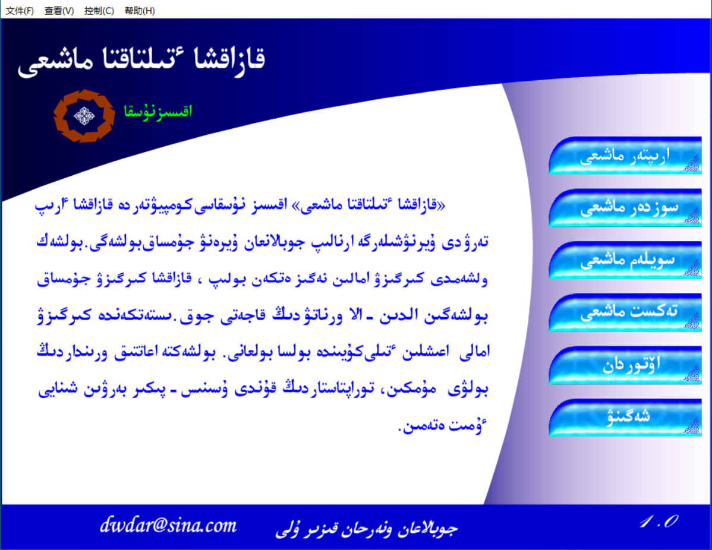
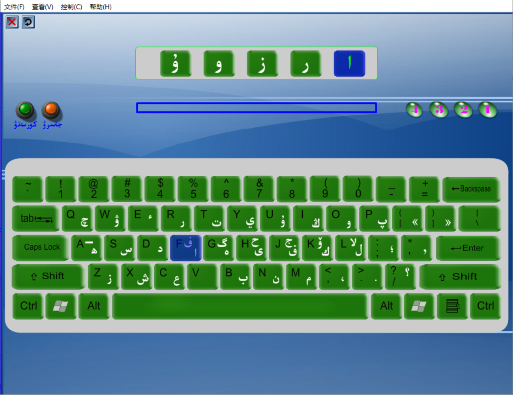
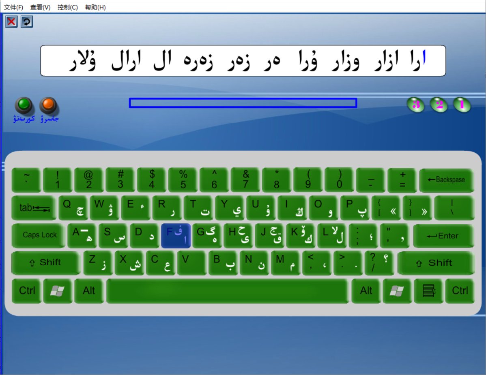
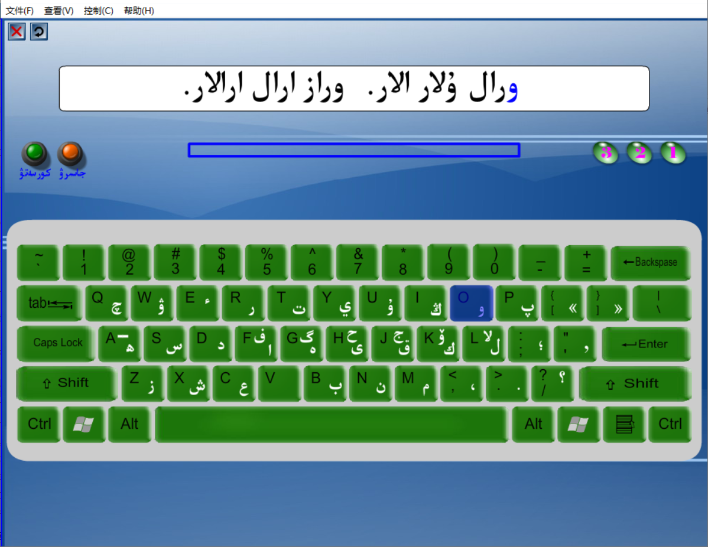
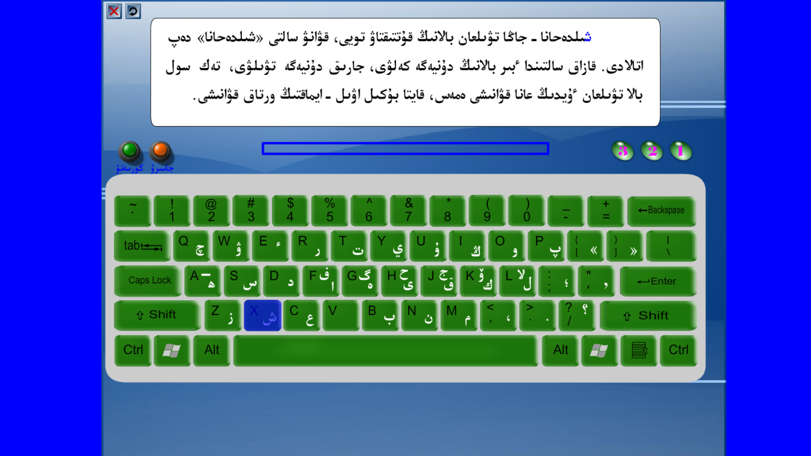
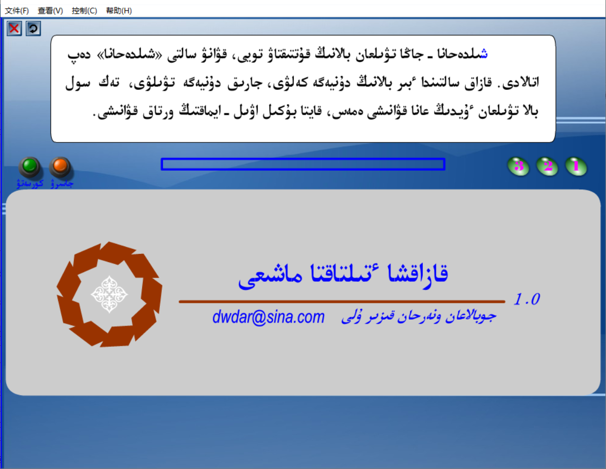
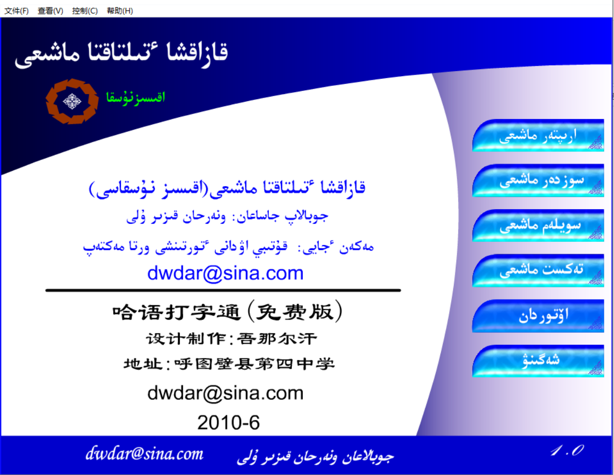

<h3 align="center">Kazakh keyboard practice(free)</h3>

哈萨克语打字通(免费版)

- Introduction:

  Kazakh Typewriting is an educational software specially designed for users who are learning Kazakh language and computer science. It aims to help users easily master Kazakh language text input skills. Since 2009, as a junior high school information technology teacher at the Fourth Middle School of Hutubi County, developers have felt a lack of specialized practice tools for Kazakh typing in their teaching. To this end, the developers have carefully developed this software to help students quickly improve their Kazakh typing skills. Considering that most operating systems do not have built-in Kazakh input methods, as well as the learning barriers that may arise from installing input methods or software, this software is specially designed for single file green and web versions, achieving a convenient experience of one click start and instant practice. In addition, by simply deploying to a web server, users can also practice directly through web pages, greatly reducing the learning threshold.

  #### 简介：
  
  哈萨克语打字通是一款专为哈萨克语初学计算机的用户量身打造的教育软件，旨在帮助用户轻松掌握哈萨克语文字录入技能。自2009年起，开发者作为呼图壁县第四中学的初中信息技术教师，深感教学中缺乏专门针对哈萨克语打字的练习工具。为此，开发者精心研发了此软件，以助力学生迅速提升哈萨克语打字水平。考虑到多数操作系统未内置哈萨克语输入法，以及安装输入法或软件可能带来的学习障碍，本软件特别设计为单文件绿色版和网页版，实现了一键启动即刻练习的便捷体验。此外，通过简单部署至Web服务器，用户还可直接通过网页进行练习，极大降低了学习门槛。
  
  #### 主要功能
  
  - 字母练习
  
    本模块通过系统化的字母练习，帮助用户迅速熟悉哈萨克语输入法中字母的键盘布局，为后续的打字技能提升奠定坚实基础。
  
  - 词语练习：
  
    词语练习模块专注于提升用户对常用哈萨克语词汇的录入速度与准确性，从而增强实际语言应用能力。
  
  - 语句练习：
  
    语句练习模块设计用于在实际语境中锻炼用户的打字技能，加深对哈萨克语句子的理解，并提高录入技巧。
  
  - 课文练习：
  
    课文练习模块提供丰富的哈萨克语课文材料，用户可在模拟的真实阅读与写作环境中进行打字练习，进一步精进打字技能。
  
  - 作者简介：
  
    开发者简介部分将详细介绍开发者的教育背景、丰富的教学经验以及开发此软件的初衷与历程，让用户深入了解软件的背景和开发者的专业性。
  
    

#### github地址

https://github.com/dwdar/KazakhKeyboardPractice.git

#### gitee地址

https://gitee.com/dwdar/kazakh-keyboard-practice.git

#### 界面截图

dwdar@sian.com

2010.6

